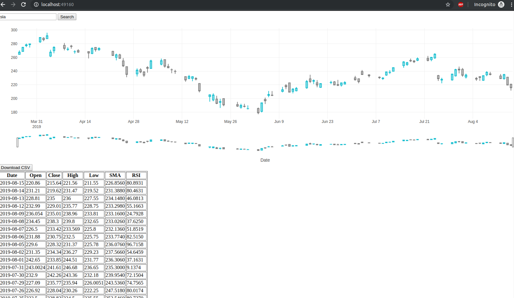

# Simple Stock App

## Gradle
### Build and run unit test
    ./gradlew :javascript-projects:hello-world-npm:npmTest

### Run app

    node server.js


## Docker
```
 docker build -t amy/simple-stock .
 docker images
 docker run -p 49160:9999 -d amy/simple-stock
 docker ps
```



## Init architectual plan
LoadBalancer -- simple-stock service pool -- [elastic cache for searched results]

## Reference
1. [nodejs best practices](https://github.com/i0natan/nodebestpractices)
2. [nodejs package](http://nodesource.com/blog/your-first-nodejs-package/)
3. [nodejs unit test](https://buddy.works/guides/how-automate-nodejs-unit-tests-with-mocha-chai)
4. [dockerize nodejs app](https://nodejs.org/de/docs/guides/nodejs-docker-webapp/)

## Todo
1. play with ci/ci provided by github